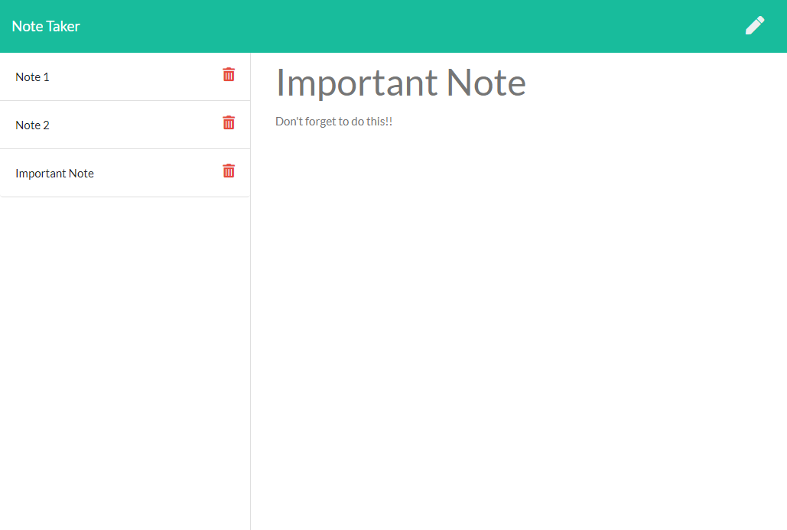

# Note Taker

## Description

An easy to use note taking application to create, save, and delete notes as needed.

## Table of Contents

* [Installation](#installation)
* [Usage](#usage)
* [Credits](#credits)
* [License](#license)

## Installation

[Launch App](https://shiftymitch-note-taker.herokuapp.com/)

## Usage 

1. Open the application link above.
2. Click Get Started.
3. Click pencil icon to add new note.
4. Click save icon to save new note.
5. Click delete icon on specific notes to delete notes.

## Credits

[Mitch Henderson](https://shiftymitch.github.io/portfolio/2)
-Wrote Server.js, apiRoutes.js, htmlRoutes.js, and updated script.js files to add functionality.

## License

## Contributing

No contributing necessary. Just clone the repo and make adjustments as needed.

## Questions

Questions can be directed via email to shiftymitch@gmail.com